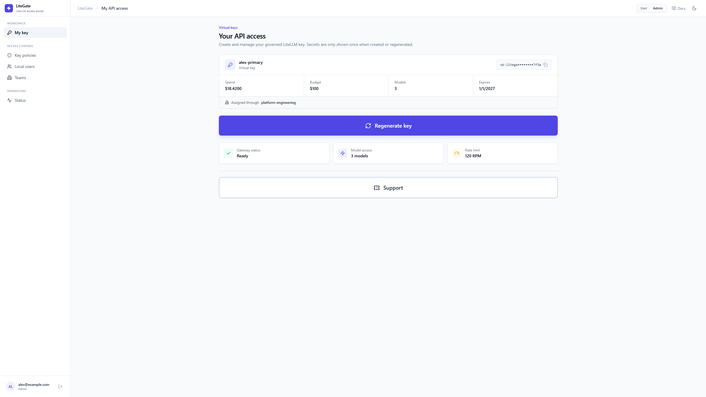

# LiteGate



LiteGate is a lightweight, self-hosted portal and automation API for managing
[LiteLLM](https://github.com/BerriAI/litellm) virtual keys. It gives people a
simple self-service experience while administrators retain control of accounts,
roles, budgets, limits, models, and key policy.

## Why LiteGate?

- Give each user a personal LiteLLM key without exposing the master key.
- Support generic OpenID Connect SSO and persistent local accounts.
- Assign administrators by SSO email or group membership.
- Map SSO groups to existing LiteLLM teams for team budgets and model policy.
- Let administrators bulk-edit key policy from the portal or API.
- Give trusted automation agents admin access through a management API key.
- Run the React frontend and FastAPI backend as a single Docker image.
- Keep the dashboard responsive by avoiding raw spend-log downloads on page load.

## Access model

| Capability | User | Administrator | Automation agent |
| --- | --- | --- | --- |
| Create, inspect, and regenerate a personal key | Yes | Yes | Via API |
| Manage local users and roles | No | Yes | Yes |
| List installation-wide keys | No | Yes | Yes |
| Bulk-edit key settings | **No** | **Yes** | **Yes** |

Bulk key editing is administrator-only in both the UI and `/api/v1`. Trusted
agents authenticate with the installation-wide `management_api_key`; they do not
need a shared human password.

## How it works

```text
People / automation agents
            |
            v
   LiteGate (React + FastAPI)
      |-- OIDC provider
      |-- SQLite local-user store
      `-- LiteLLM management API
                    |
                    v
            LiteLLM virtual keys
```

LiteGate is an access layer, not a LiteLLM replacement. LiteLLM remains
responsible for virtual keys, models, budgets, usage, and request routing.

## Quick start with Docker Compose

Requirements: Docker with Compose, a reachable LiteLLM instance, and its master
key.

```bash
git clone https://github.com/brtydse100/litegate.git
cd litegate/deploy/docker-compose
```

Edit `config.yaml`:

```yaml
litellm_url: "http://host.docker.internal:4000"
litellm_master_key: "sk-your-litellm-master-key"
jwt_secret: "replace-with-a-long-random-secret"

# Bootstrap administrator; replace before first use.
local_auth_username: "admin"
local_auth_password: "replace-with-a-strong-password"

root_url: "http://localhost"
```

Start LiteGate from the prebuilt GitHub package:

```bash
docker compose -f docker-compose.image.yml up -d
```

This pulls `ghcr.io/brtydse100/litegate:latest` for `linux/amd64`. To pin a
release, set `LITEGATE_VERSION`, for example `LITEGATE_VERSION=2.1.0`. Other
architectures can build locally from source:

```bash
docker compose up --build
```

Open [http://localhost](http://localhost). Local accounts persist in the
`litegate-data` Docker volume. Replace every sample secret before using LiteGate
outside a local test environment.

## Documentation

| Guide | Contents |
| --- | --- |
| [Documentation index](docs/README.md) | Entry point for all guides |
| [Features and access model](docs/features.md) | User, admin, bulk-edit, and operational behavior |
| [Authentication](docs/authentication.md) | OIDC, local users, roles, and automation agents |
| [Configuration](docs/configuration.md) | Settings, environment variables, and key defaults |
| [Deployment](DEPLOYMENT.md) | Docker Compose, offline use, Kubernetes, and Helm |
| [API v1](API.md) | Authentication, key endpoints, bulk updates, and local users |
| [Development](docs/development.md) | Local setup, tests, architecture, and project layout |

Once deployed, interactive API documentation is available at `/api/docs`, with
ReDoc at `/api/redoc` and the OpenAPI document at `/api/openapi.json`.

## Security

LiteGate verifies OIDC token signatures and claims, uses short-lived signed OIDC
state, and stores local passwords as salted PBKDF2-SHA256 hashes. Account status
and local roles are rechecked on authenticated requests. Key-changing operations
are rate limited, bulk updates use bounded concurrency, and the included Nginx
configuration adds common browser security headers.

For production, use HTTPS, restrict access to configuration and secrets, rotate
the management API key if exposed, and back up the local-user database or volume.
See [Authentication and security](docs/authentication.md#security-behavior) for
the complete behavior and trust boundaries.

## Development and checks

```bash
cd backend && python -m pytest
cd ../frontend && npm run build && npm audit --omit=dev
```

See the [development guide](docs/development.md) for environment setup and local
development commands.

## License

No open-source license has been selected yet. The repository is public, but
normal copyright restrictions apply until a license is added.
